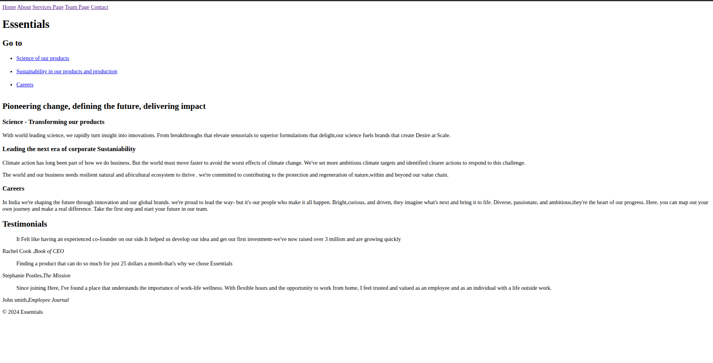
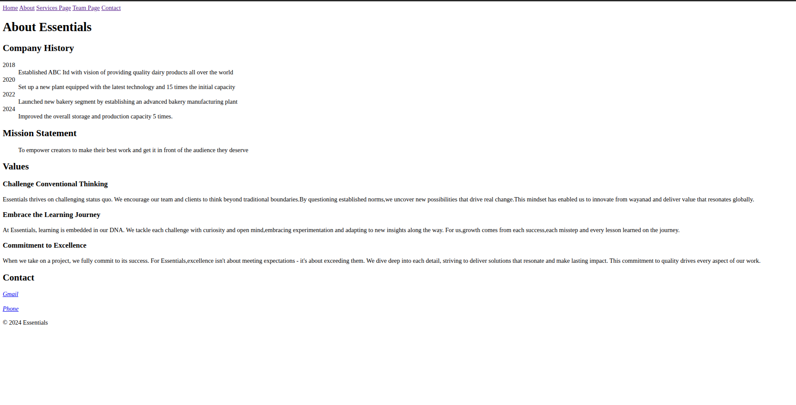
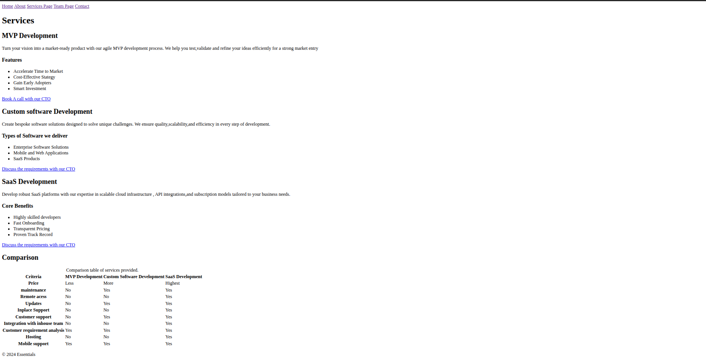
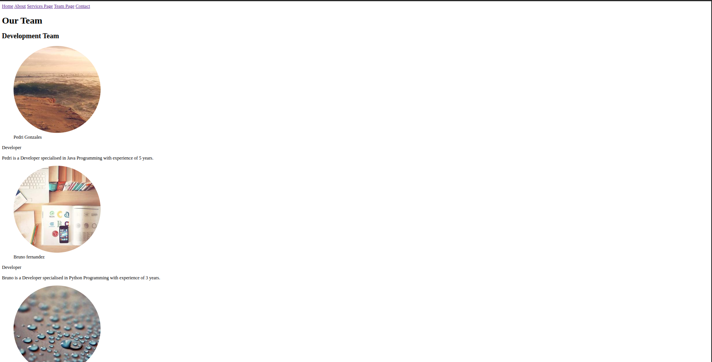
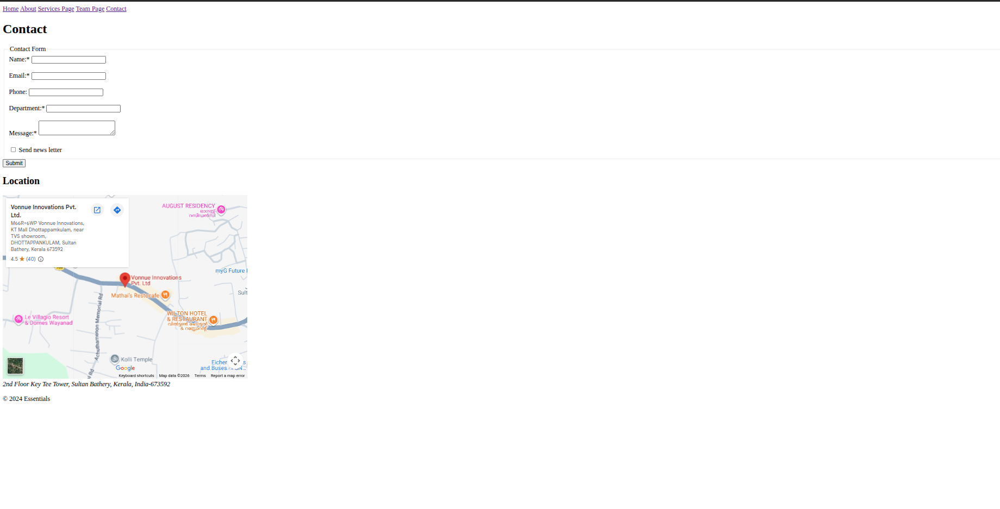

# week1-project

[open the website](https://hawas-vonnue.github.io/week1-project/)

This is a website of a company with Home , About, Services , Team and Contact Pages.

## Home Page

## About Page

## Services Page

## Team Page

## Contact Page

## Tech Used

HTML

## How to Open Locally

- Clone the repo:
  `git clone https://github.com/hawas-vonnue/week1-project.git`
- change to the project repo:
  `cd week1-project`
